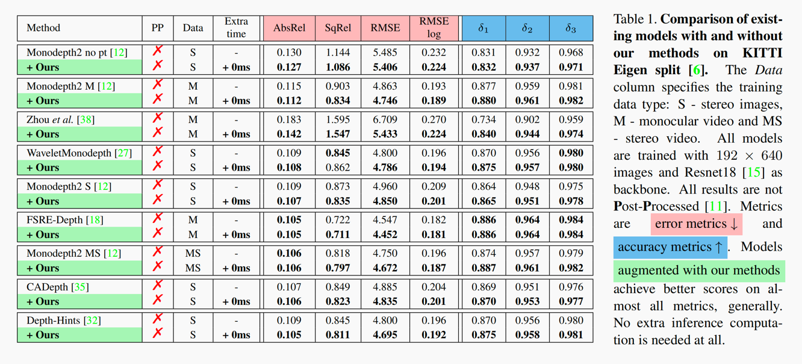

# Freq-Aware-Depth

This is the official PyTorch implementation of our paper "[Frequency-Aware Self-Supervised Depth Estimation](https://arxiv.org/abs/2210.05479)" (**WACV 2023**)

We introduce **FreqAwareDepth**, with highly generalizable performance-boosting features that can be easily integrated into other models, see the [paper](https://arxiv.org/abs/2210.05479) for more details.

Our methods introduce no more than **10%** extra training time and no extra inference time at all.

### 🎬 Watch our [video](https://youtu.be/iAJ4TQHNd_s).


## 🍻 KITTI Results


## 🛠️ Setup

Assuming a fresh [Anaconda](https://www.anaconda.com/download/) distribution, you can install the dependencies with:
```shell
conda install pytorch=1.7.1 torchvision=0.8.2 -c pytorch 
pip install tensorboardX==1.5     # 1.4 also ok
conda install opencv=3.4.2    # just needed for evaluation, 3.3.1 also ok
```
Our code is build upon [monodepth2](https://github.com/nianticlabs/monodepth2).


## 🚄 Training

**Train our full model:**
```shell
python train.py --model_name {name_you_expect}
```


### KITTI training data

You can download the entire [KITTI RAW dataset](http://www.cvlibs.net/datasets/kitti/raw_data.php) by running:
```shell
wget -i splits/kitti_archives_to_download.txt -P kitti_data/
```
Then unzip with
```shell
cd kitti_data
unzip "*.zip"
cd ..
```
**Warning:** it weighs about **175GB**.


## 👀 Predict depth for a single image

```shell
python test_simple.py --image_path assets/test_image.jpg --model_path {pretrained_model_path}
```


## 💯 KITTI evaluation

To evaluate, run:
```shell
python evaluate_depth.py --eval_mono --load_weights_folder {model_path}
```

🐷 **Note**: Make sure you have run the command below to generate ground truth depth before evaluating.
```shell
python export_gt_depth.py --data_path {KITTI_path} --split eigen
```


## ✏️ Citation

If you find our work useful or interesting, please consider citing [our paper](https://arxiv.org/abs/2210.05479).

